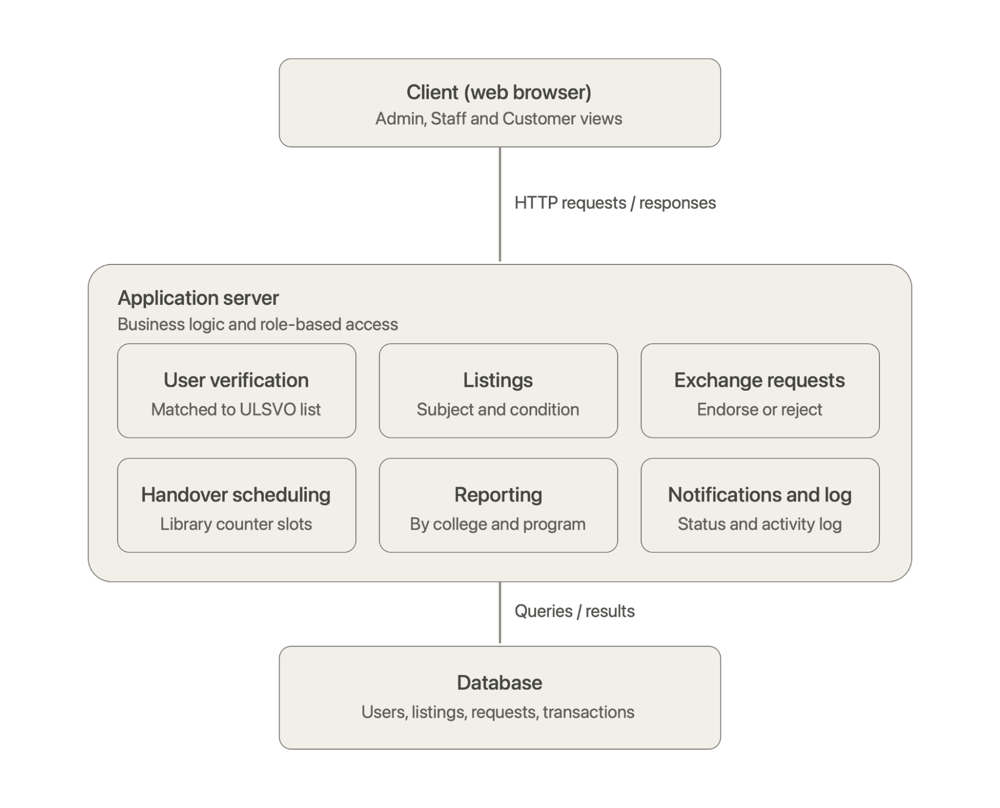

# BookSwap: A Centralized Peer-to-Peer Book Exchange Platform for Bookworms

**Project Proposal Document (Phase 1)** · ITS122P · Group 3 | Section AM6 · September 2026

Aldea, Adrian Ivan · De Leon, Irish Gail · Dorosan, Jade Danielle · Jerusalem, Myrielle Alexcis · Sabayo, Arnulfo III

> This is a text copy of the official Phase 1 document, "[Phase 1] BookSwap_Project_Document_Group_3". If the two ever differ, the official document wins.

## 1. Problem Statement

Avid readers frequently face high costs when growing their personal libraries and lack a structured, reliable platform to pass on or acquire books they've already read or want to read next. Informal book trades (via social media groups, garage sales, or community bulletin boards) result in:

- Unverified book conditions and misrepresented editions or damaged copies.
- Unreliable scheduling, high no-show rates, and zero accountability during handovers.
- Lack of platform-wide oversight, preventing the community from identifying popular genres and tracking reading trends and participation among members.

## 2. Target Users

- **Readers / Book Enthusiasts (Customers):** Registered members looking to exchange, discover, and collect books across genres for personal enjoyment.
- **Volunteer Moderators (Staff / Exchange Moderators):** Community volunteers responsible for validating book conditions, verifying listing authenticity, and overseeing handovers at designated meetup points.
- **Platform Administrators (System Administrators):** Staff handling account verification, taxonomy governance, activity auditing, and platform-wide analytics reporting.

## 3. Proposed Features

Features are numbered by role so that each capability has one accountable owner. Sub-points state the operating rule, not the implementation.

### 3.1 Administrator

#### 3.1.1 Account Verification and User Management
- Approves pending registrations by verifying the submitted email address and, where required, a phone number to reduce fake accounts and spam.
- Deactivates accounts for prolonged inactivity, policy violation, or user request, and reactivates them on appeal.
- Issues password resets for locked accounts without viewing stored credentials.

#### 3.1.2 Role Assignment
- Grants Staff (Exchange Moderator) access to trusted community volunteers for the duration of their term of service.
- Revokes Staff access when a volunteer steps down, while preserving the transaction history they processed.
- Enforces a minimum of one active Administrator account at all times.

#### 3.1.3 Category and Taxonomy Management
- Maintains the genres, formats, and age/reading categories (e.g., Children's, Young Adult, Adult) used to tag every listing.
- Maintains book condition grades (for example: Like New, Good, Fair, Heavily Used) with written descriptions shown to users at the time of listing.
- Retires unused categories by marking them inactive rather than deleting them, so historical listings remain readable.

#### 3.1.4 Master Record Management
- Views any listing, exchange request, or transaction regardless of owner.
- Corrects erroneous entries, such as a miscategorized listing or a transaction closed in the wrong state.
- Archives records at the end of each reporting period so the active catalog reflects only current listings.

#### 3.1.5 Reporting
- Generates periodic reports covering listings posted, exchanges completed, cancellation rate, and most requested genres.
- Generates participation reports by region/city and reader age group to guide community engagement and event planning.
- Exports reports in printable form for community updates or partner sponsorships.

#### 3.1.6 System Content and Audit Oversight
- Publishes the exchange policy, community guidelines, and announcements displayed on the landing page.
- Defines the pool of available meetup points and time slots for each reporting period.
- Reviews the activity log to trace who verified, approved, or modified a given record.

### 3.2 Staff/Employee (Exchange Moderator)

#### 3.2.1 Listing Verification
- Reviews each submitted listing for completeness, a legible photo, and a plausible condition grade.
- Approves the listing for publication, returns it to the owner for revision with a note, or rejects it with a recorded reason.
- Flags submissions that violate platform policy, such as pirated or unauthorized reproductions.

#### 3.2.2 Exchange Request Monitoring
- Monitors exchange requests between users but does not approve or reject them, since the decision rests with the listing owner.
- Acts on requests reported as spam or abusive and records the action taken.
- Cancels requests left unanswered by the listing owner beyond the response window set for the period.

#### 3.2.3 Transaction Status Management
- Advances each transaction created from an accepted request through the defined workflow: Accepted, Scheduled, then Completed or Cancelled.
- Records a reason for every cancellation so recurring causes can be surfaced in the Administrator's reports.
- Keeps both listings locked from the moment a request is accepted, preventing either book from entering a second active exchange.

#### 3.2.4 Handover Scheduling
- Assigns a date, time slot, and meetup location for each accepted exchange, drawn from the locations and slots defined by the Administrator.
- Reschedules on request from either party, subject to a limit of one reschedule per transaction.
- Records no-shows against the transaction and returns both listings to available status.

#### 3.2.5 Dispute and Report Handling
- Receives reports covering misdescribed condition, no-shows, and inappropriate listings.
- Records findings and the resolution reached against the affected transaction.
- Escalates repeat offenders to the Administrator for account-level action.

#### 3.2.6 Moderation Dashboard
- Displays pending verifications, newly accepted exchanges awaiting a handover schedule, and the handovers scheduled for the current day.
- Highlights listings that have remained idle beyond a set number of days for follow-up or archiving.
- Shows a count of items processed, which volunteers may attach to their duty records.

### 3.3 Customer/User (Reader)

#### 3.3.1 Registration and Profile Management
- Registers using an email address (and optional phone number for verification), with the account remaining pending until Administrator approval.
- Maintains favorite genres, city/location, and contact number, which are used for handover coordination.
- Displays a completed-exchange count on the public profile as a simple reliability indicator.

#### 3.3.2 Book Listing Submission
- Submits title, author, edition, publisher, genre, condition grade, and at least one photograph of the actual copy.
- States the genre, title, or type of book preferred in return, or marks the listing as open to any offer.
- Edits or withdraws a listing while it is unverified or unmatched, after which the listing is locked by the system.

#### 3.3.3 Catalog Browsing and Search
- Searches by title, author, or keyword, and filters results by genre, age category, and condition.
- Sorts results by date posted or by relevance to the user's favorite genres.
- Saves listings to a watchlist and receives a notification when a watched title becomes available.

#### 3.3.4 Exchange Request Submission
- Selects a published listing and offers one of their own verified listings in return, with the request sent directly to the listing's owner.
- Attaches a short message indicating preferred handover timing.
- Submits at most one active request per target listing, which prevents queue flooding.

#### 3.3.5 Incoming Request Response
- Accepts or declines requests received on their own listings, and acceptance is allowed only while both books are still verified and available.
- Declines using a selectable reason so the requester receives usable feedback. Accepting one request automatically declines other pending requests involving either book.
- Withdraws a sent request at any point before the listing owner accepts it.

#### 3.3.6 Status Tracking and Handover Confirmation
- Tracks all owned listings, sent requests, received requests, and transactions from a single dashboard.
- Receives in-app notifications on verification results, request outcomes, and handover schedules.
- Confirms receipt after the physical swap, or files a report if the book condition does not match the listing.

### 3.4 Traceability to Core Capabilities

Table 1 maps each core capability of the platform to the features that own it, as numbered in Sections 3.1 through 3.3.

**Table 1** — *Traceability of Core Capabilities to Owning Features*

| Core Capability | Owning Features |
|---|---|
| Listing books | 3.3.2, verified under 3.2.1, categorized under 3.1.3 |
| Browsing and searching | 3.3.3, catalog governed by 3.1.3 and 3.1.4 |
| Sending exchange requests | 3.3.4, accepted or declined under 3.3.5, monitored under 3.2.2 |
| Managing transactions | 3.2.3, 3.2.4, 3.2.5, confirmed by 3.3.6, reported under 3.1.5 |

## 4. User Roles

Role definitions follow the operating rules described above. Each item states the responsibility first, then the permission boundary attached to it.

### 4.1 Administrator
- **Manage users.** Holds full create, update, and deactivate rights over all accounts, and is the only role that can assign or revoke the Staff and Customer/User designations. Account approval is an Administrator action, so no user reaches an active state without identity verification.
- **Manage categories.** Sole authority over genres, formats, age categories, and condition grades. No other role may add, rename, or retire a category, which keeps the catalog taxonomy consistent across reporting periods.
- **Manage records.** Unrestricted read access to all listings, requests, and transactions, with rights to correct, archive, or delete any entry. Every corrective action is written to the activity log with the Administrator's identity attached.
- **Manage reports.** The only role with system-wide analytics access. Generates and exports periodic reports for the community, and is not expected to perform daily moderation work.

### 4.2 Staff/Employee
- **Process requests.** Verifies submitted listings before publication and may approve, return for revision, or reject each one, always with a recorded reason. Exchange requests are decided by the receiving user, so Staff only monitors them and acts on reported or expired requests.
- **Update status.** Once the listing owner accepts a request, Staff is the only role permitted to advance or cancel the resulting transaction. Users control only the request stage (sending, withdrawing, accepting, or declining) and cannot alter a transaction state afterward.
- **Manage transactions.** Assigns handover schedules, records completion and no-shows, and documents disputes and their resolutions against the transaction record.
- **Permission limits.** Cannot create, delete, or reassign user accounts, cannot modify categories, and cannot access system-wide reports. Access to a user's contact details is limited to parties in transactions the Staff member is handling.

### 4.3 Customer/User
- **Register.** Self-registers using an email address, with the account activating only upon Administrator approval. Maintains their own profile and may deactivate their own account.
- **Submit requests and bookings.** Posts book listings, sends exchange requests against other users' listings, accepts or declines requests received on their own listings, and takes an assigned handover slot.
- **View status.** Tracks the state of their own listings, sent and received requests, and completed transactions, and receives notifications at each state change.
- **Permission limits.** May view or modify only their own records. Cannot see another user's contact details until an exchange request between them has been accepted, and cannot view any report or administrative screen.

### 4.4 Permission Matrix

Table 2 summarizes the capabilities granted to each role.

**Table 2** — *Role-Based Permission Matrix*

| Capability | Administrator | Staff/Employee | Customer/User |
|---|---|---|---|
| Approve or deactivate accounts | Yes | No | No |
| Assign roles | Yes | No | No |
| Manage categories | Yes | No | No |
| Post a book listing | No | No | Yes |
| Verify a listing | Yes | Yes | No |
| Send an exchange request | No | No | Yes |
| Accept or decline an exchange request | No | No | Own only |
| Change transaction status | Yes | Yes | No |
| Schedule a handover | Yes | Yes | No |
| Confirm receipt after handover | No | No | Yes |
| View all records | Yes | Assigned only | Own only |
| Generate reports | Yes | No | No |

### 4.5 Role Separation Rules
- Each account carries exactly one role. Role changes are performed only by the Administrator and are written to the activity log.
- A Staff volunteer who wishes to exchange books personally maintains a separate Customer/User account. The system blocks a Staff member from verifying, scheduling, or completing any transaction in which they are a party.
- The Administrator holds override authority but does not participate in routine moderation, so the audit trail distinguishes normal processing from corrective intervention.
- Every state change on a listing, request, or transaction stores the acting user's identity and a timestamp, which supports both dispute resolution and the reporting features in Section 3.1.5.

## 5. System Architecture

Figure 1 presents the system architecture of BookSwap, which follows a three-tier design. The React client communicates with the PHP application server over HTTPS. The server handles business logic and role-based access, connects to external services for login and email notifications, and stores data in a MySQL database, with book photographs kept in server-side file storage.

**Figure 1** — *System Architecture of BookSwap*

Figure 2 presents the initial Entity-Relationship Diagram (ERD) of the system.

**Figure 2** — *Initial Entity-Relationship Diagram of BookSwap*

## 6. Technology Stack

The system is built on a layered architecture consisting of a React-based frontend, a PHP backend that handles business logic and access control, and a MySQL database implementing the entity relationships defined in the ERD. One of each layer was selected to support role-based functionality, data integrity, and maintainability across the application. Since this is a public-facing consumer platform rather than an institution-gated one, the backend also integrates a small set of third-party APIs to handle login and notifications. Table 3 summarizes the selected technologies by layer.

**Table 3** — *Technology Stack by Architectural Layer*

| Layer | Technology | Purpose |
|---|---|---|
| Frontend | React.js | Builds the interface for the Administrator, Staff/Employee, and Customer/User views through reusable components such as listing cards, forms, and dashboards. |
| | Tailwind CSS or Bootstrap | Provides consistent styling for forms, tables, and navigation elements. Ensures a uniform, professional appearance across all screens. |
| | Axios | Handles communication between the frontend and backend API. Simplifies sending and receiving data for listings, requests, and transactions. |
| Backend | PHP | Processes API requests, including account management, listing management, exchange request handling, and transaction status updates. Centralizes the system's business logic in one server-side layer. |
| | OAuth 2.0 (Google / Facebook Login API) | Lets readers sign up and log in with an existing social account, lowering the barrier to entry for a casual, entertainment-focused user base. |
| | JWT (JSON Web Tokens) | Issues signed tokens on login to authenticate API requests statelessly, used alongside or in place of PHP Sessions where the frontend and backend are hosted separately. |
| | PHP Sessions | Manages login state for the moderation dashboard and enforces role-based access control, keeping Administrator, Staff, and Customer permissions properly separated. |
| | Transactional Email API (e.g., SendGrid or Mailgun) | Sends account verification links, password resets, and exchange/watchlist notifications. |
| Database | MySQL | Stores all entities defined in the ERD (User, Listing, Exchange Request, Transaction, Handover Slot, Genre, etc.) with foreign key relationships enforced at the schema level. Maintains data integrity across related records. |
| File Storage | Server-side file storage | Stores uploaded book photographs, with file paths referenced in the Listing table. Keeps media handling simple while remaining easy to migrate to cloud storage later. |
| Development and Deployment | Apache, MySQL, and PHP (local environment) | Provides a unified setup for backend development and testing. |
| | phpMyAdmin | Used to build and manage the database schema derived from the ERD. |
| | Git and GitHub | Supports version control and coordinated development. |
| Hosting | Vercel | Hosts the React frontend with automatic deployment from GitHub and a global CDN for fast load times. |
| | InfinityFree | Hosts the PHP backend and MySQL database together, requiring no credit card or additional configuration. |
