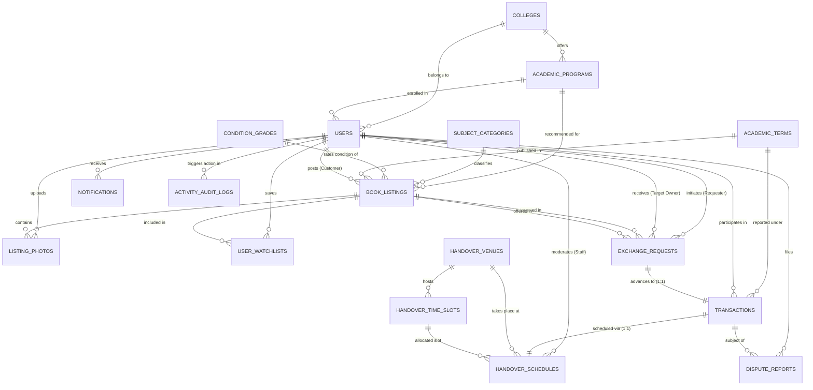

# BookSwap: Database Design, Initial ERD & API Data Dictionary
**Document Category:** Member 4 Deliverable (Database / API Developer)  
**Project:** Centralized Peer-to-Peer Academic Book Exchange Platform for ULSVO  
**Database System:** MySQL 8.0+ / MariaDB (InnoDB, utf8mb4)  
**Hosting Environment:** InfinityFree MySQL / Local Apache-MySQL (XAMPP)

---

## 1. Role & Responsibility (Member 4)
As **Member 4 (Database / API Developer)**, the responsibility encompasses:
1. Translating all business rules, user workflows, and permission boundaries from the proposal paper into a fully normalized, relational database schema (3NF).
2. Designing the **Entity-Relationship Diagram (ERD)** defining entities, attributes, primary/foreign keys, and cardinalities.
3. Providing production-grade MySQL DDL (`bookswap_schema.sql`) and comprehensive sample seed data (`bookswap_seed.sql`).
4. Defining the REST API data contracts and SQL query specifications for **Member 3 (Backend Developer)** and **Member 2 (Frontend Developer)**.

---

## 2. Entity-Relationship Diagram (ERD)

---

## 3. Relational Schema & Cardinality Specifications

1. **`colleges` to `academic_programs`** (1 : N)
   - One college offers multiple degree programs (e.g., SOIT offers BSIT, BSIS).
2. **`users` to `book_listings`** (1 : N)
   - One verified Customer/User may post multiple book listings.
3. **`book_listings` to `listing_photos`** (1 : N)
   - Every listing must contain at least one actual, legible photograph of the physical copy (Rule 4.3.2).
4. **`book_listings` to `exchange_requests`** (1 : N)
   - A target listing can receive exchange requests from different verified books; a UNIQUE constraint enforces at most 1 active request per requester per target book to prevent queue flooding (Rule 4.3.4).
5. **`exchange_requests` to `transactions`** (1 : 1)
   - An exchange request that is accepted by the owner and endorsed by Staff advances into exactly one official transaction record (Rule 4.2.3).
6. **`transactions` to `handover_schedules`** (1 : 1)
   - Each approved transaction is allocated exactly one physical handover schedule at the ULSVO library counter (Rule 4.2.4).
7. **`handover_venues` to `handover_time_slots`** (1 : N)
   - The standing library counter venue contains predefined pools of operational time slots per term (Rule 4.1.6).

---

## 4. Traceability to Proposal Paper Features

| Entity / Table | Paper Section & Feature | Business Rule Enforced |
| :--- | :--- | :--- |
| **`users`** | 4.1.1, 4.3.1, 5.1 | Accounts remain `PENDING` until Admin approval matching ULSVO enrollment list. Strict `role` separation (`ADMINISTRATOR`, `STAFF`, `CUSTOMER`). |
| **`condition_grades`** | 4.1.3, 4.3.2 | Predefined grades (`Like New`, `Good`, `Fair`, `Heavily Used`) with mandatory written descriptions shown at listing time. |
| **`academic_terms`** | 4.1.4, 4.1.5 | Supports term-end record archiving so the active catalog reflects only the current semester while preserving historical data. |
| **`book_listings`** | 4.2.1, 4.3.2 | Staff moderation workflow (`PENDING`, `APPROVED`, `REJECTED`, `FLAGGED_POLICY_VIOLATION`). Locks automatically upon transaction approval. |
| **`exchange_requests`** | 4.2.2, 4.3.4, 4.3.5 | Two-tier approval (Owner accepts/declines with reason $\rightarrow$ Staff endorses/holds/rejects). Prevents queue flooding via composite unique key. |
| **`transactions`** | 4.2.3, 5.2 | Defined status workflow: `PENDING` $\rightarrow$ `APPROVED` $\rightarrow$ `SCHEDULED` $\rightarrow$ `COMPLETED` / `CANCELLED`. Mandatory cancellation reason recording. |
| **`handover_schedules`** | 4.1.6, 4.2.4 | Enforces standing library counter venue and maximum **1 reschedule limit** per transaction via `CHECK (reschedule_count <= 1)`. Records no-show party. |
| **`dispute_reports`** | 4.2.5, 4.3.6 | Logs misdescribed book conditions, no-shows, and inappropriate listings. Stores staff findings and allows escalation to Administrator. |
| **`activity_audit_logs`** | 4.1.6, 7.4 | Comprehensive immutable audit trail logging acting user ID, role, action type, timestamp, and JSON snapshot for all state transitions. |

---

## 5. REST API Endpoints Specification (Member 4 Data Contract)

### A. Authentication & User Profile
- `POST /api/auth/register` $\rightarrow$ Inserts into `users` with status `PENDING`.
- `POST /api/auth/login` $\rightarrow$ Authenticates user, initializes role session (`ADMINISTRATOR`, `STAFF`, `CUSTOMER`).
- `GET /api/users/profile/:id` $\rightarrow$ Returns profile data + `completed_exchange_count`.

### B. Catalog & Listing Management
- `GET /api/listings` $\rightarrow$ Searches verified listings (`verification_status = 'APPROVED'`, `listing_status = 'VERIFIED_AVAILABLE'`). Supports query params: `category_id`, `program_id`, `year_level`, `condition_grade_id`, `search`.
- `POST /api/listings` $\rightarrow$ Creates draft listing with uploaded photos into `book_listings` and `listing_photos`.
- `PUT /api/staff/listings/:id/verify` $\rightarrow$ Staff endpoint: Sets `verification_status` to `APPROVED`, `RETURNED_FOR_REVISION`, or `REJECTED`.

### C. Exchange Requests & Handover Transactions
- `POST /api/requests` $\rightarrow$ Inserts into `exchange_requests` (validates that both requester's book and target book are verified).
- `PUT /api/requests/:id/respond` $\rightarrow$ Target book owner accepts or declines with reason.
- `PUT /api/staff/requests/:id/endorse` $\rightarrow$ Staff endorses request; triggers transaction creation and locks both listings (`trg_lock_listings_on_approved`).
- `POST /api/staff/transactions/:id/schedule` $\rightarrow$ Assigns library counter date and time slot in `handover_schedules`.
- `PUT /api/transactions/:id/confirm-receipt` $\rightarrow$ Customer confirms physical receipt; triggers `COMPLETED` state when both confirm.
